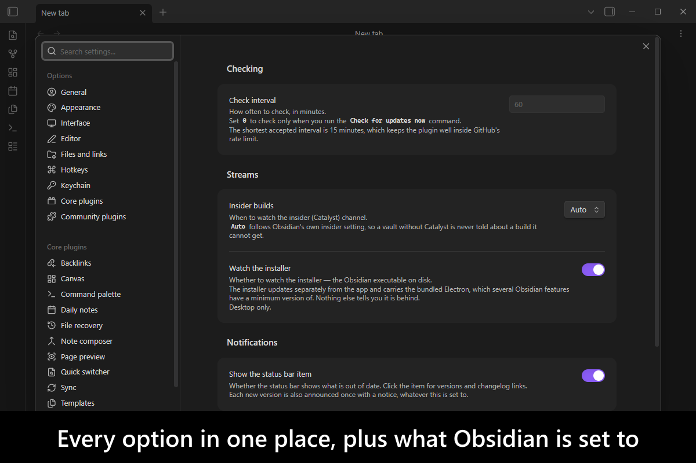
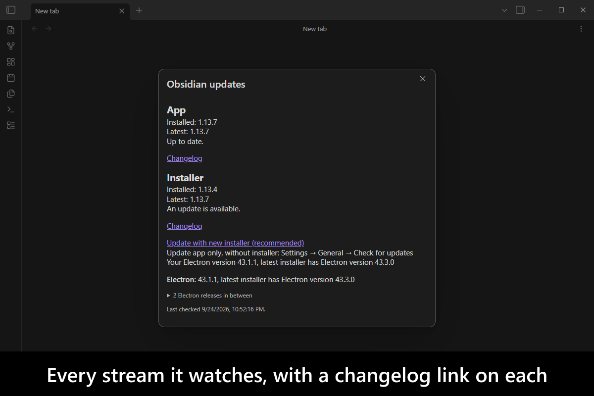
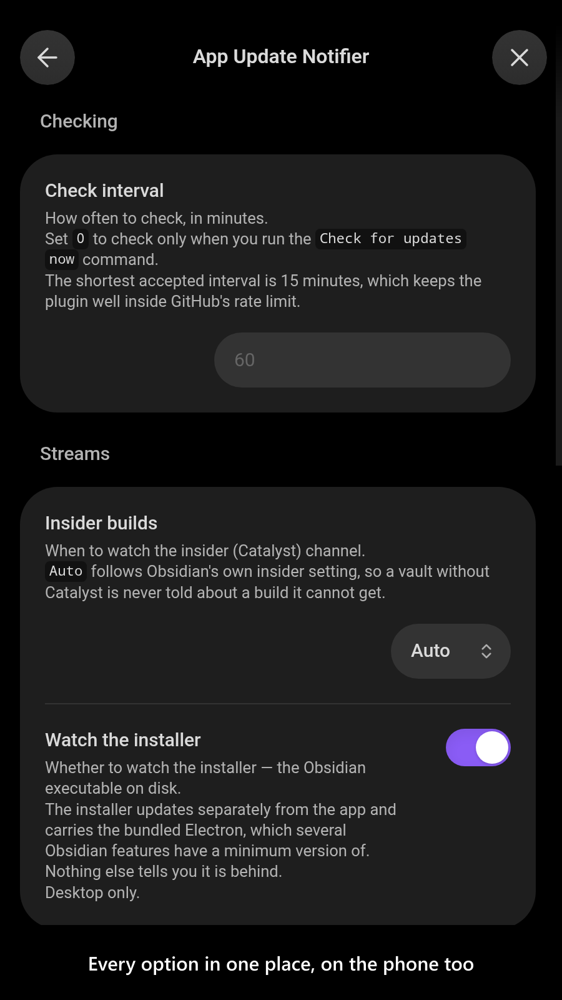
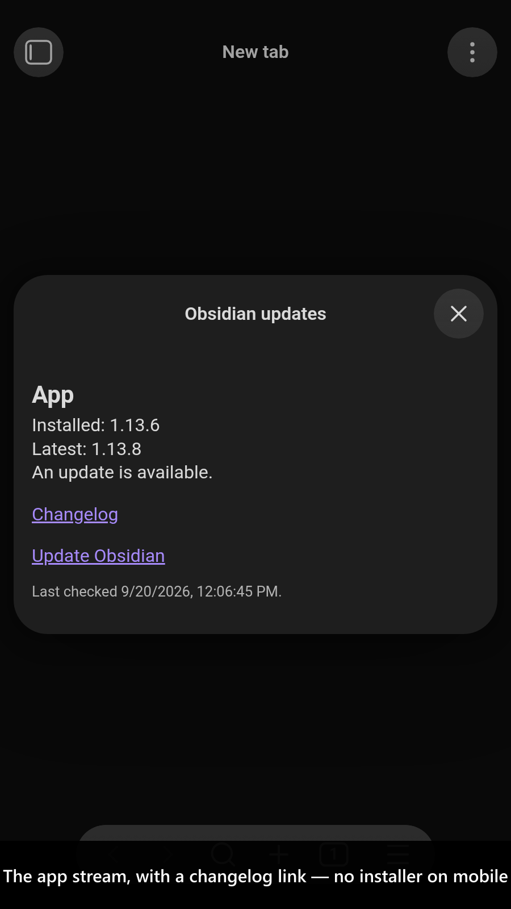

# App Update Notifier

[](https://www.buymeacoffee.com/mnaoumov) [](https://github.com/mnaoumov/obsidian-app-update-notifier/releases) [](https://github.com/mnaoumov/obsidian-app-update-notifier/releases) [](https://github.com/mnaoumov/obsidian-app-update-notifier)

Turning off Obsidian's automatic updates also turns off its checking, so from then on nothing tells you a release happened — and the installer version, which carries the Electron that gates several Obsidian features, is never checked at all. This plugin watches all three release streams — the app, the insider (Catalyst) build and the installer — reports what is behind in the status bar, and announces each new version exactly once with a link to its changelog. It never installs anything.

<!-- markdownlint-disable MD033 -->

<a href="https://github.com/mnaoumov/obsidian-app-update-notifier/blob/HEAD/images/screenshots/screenshot-desktop-1.png"></a>

<details>
<summary>More screenshots</summary>

<div>
<a href="https://github.com/mnaoumov/obsidian-app-update-notifier/blob/HEAD/images/screenshots/screenshot-desktop-2.png"></a>
<a href="https://github.com/mnaoumov/obsidian-app-update-notifier/blob/HEAD/images/screenshots/screenshot-mobile-1.png"></a>
<a href="https://github.com/mnaoumov/obsidian-app-update-notifier/blob/HEAD/images/screenshots/screenshot-mobile-2.png"></a>
</div>

</details>

<!-- markdownlint-enable MD033 -->

## Demo vault

**The documentation is a demo vault.** Every feature has a note that explains what it does and why you would want it, with buttons that run a real check, read what this machine is actually running, and forget which versions you have already been told about — so you see the plugin working rather than read a description of it.

**[Start reading here](<./demo-vault/00 Start.md>)** — it is plain markdown, so it works on GitHub with nothing installed.

A copy of the vault ships with every release. You can access it via any of the following:

1. Running the **App Update Notifier: Open demo vault** command.
2. Downloading `app-update-notifier-demo-vault-<version>.zip` (`<version>` is the release version) from the [Releases](https://github.com/mnaoumov/obsidian-app-update-notifier/releases).
3. Browsing its source in [`demo-vault/`](./demo-vault/README.md) in this repository.

## What it does

### The three streams

Obsidian's version is three separate answers that move independently, and this plugin reports each one.

- **App**
  - the `obsidian.asar` bundle Obsidian loads, and the only piece automatic updates replace. Read from `desktop-releases.json`, the same file Obsidian's own updater reads. On Android, from the newest release that shipped an `.apk`.
- **Insider build**
  - the same app published ahead of the public release to Catalyst license holders. Watched by default only when Obsidian's own insider setting is on, so a vault without Catalyst is never told about a build it cannot install.
- **Installer**
  - the executable installed on this machine, which **automatic updates never touch**. It carries the bundled Electron, and Obsidian gates features on a minimum Electron version — so an old installer silently withholds features with nothing in the interface connecting the two. Desktop only.

### What it does with them

- **A status bar item** showing what is behind, or **Obsidian: up to date**. Clicking it opens a panel listing every watched stream, what is installed against what is published, and a changelog link for each. Before the first successful check it says **not checked**, which is deliberately not dressed up as "up to date".
- **One notice per new version, ever.** A version already announced is never mentioned again — not on the next check, not after a restart.
- **A changelog link on everything.** A version with no public GitHub release, which is the normal case for a Catalyst build, still resolves its changelog from Obsidian's changelog feed.
- **An Electron warning** when the bundled version is below `28.2.3`, the floor Obsidian itself checks, with the download link built the same way Obsidian's own recommendation builds it.
- **Both ways to take an update, on the notice and in the panel.** *Update with new installer (recommended)* links the download page for your operating system and architecture; beside it, `Settings → General → Check for updates` names the route that replaces the app bundle alone and leaves the installer where it is. It is a path rather than a button on purpose — Obsidian's own button is wired to an internal updater a plugin could only press by matching translated text in the DOM.
- **A license-aware Catalyst row.** An insider build you cannot install is not a dead end: the panel says what is needed and links Obsidian's early-access page. It never claims you have no Catalyst — Obsidian exposes no way to read that, only whether the insider setting is on.
- **A `Check for updates now` command**, for when you would rather not wait for the next scheduled check.

Checks run once at startup and then hourly, matching Obsidian's own updater; the interval is configurable, and `0` leaves only the command. A check makes four requests, one of which reaches GitHub's API — so an hourly check uses one of its sixty per hour. A failed check is silent and keeps the last answer it had, rather than reporting "up to date" when it means "could not tell".

## Installation

The plugin is not yet listed in [the official Community Plugins repository](https://community.obsidian.md/plugins). Until it is, install it as a beta release.

### Beta versions

To install the latest beta release of this plugin (regardless if it is available in [the official Community Plugins repository](https://community.obsidian.md) or not), follow these steps:

1. Ensure you have the [BRAT plugin](https://community.obsidian.md/plugins/obsidian42-brat) installed and enabled.
2. Click [Install via BRAT](https://intradeus.github.io/http-protocol-redirector?r=obsidian://brat?plugin=https://github.com/mnaoumov/obsidian-app-update-notifier).
3. An Obsidian pop-up window should appear. In the window, click the `Add plugin` button once and wait a few seconds for the plugin to install.

## Debugging

By default, debug messages for this plugin are hidden.

To show them, run the following command:

```js
window.DEBUG.enable('app-update-notifier');
```

For more details, refer to the [documentation](https://mnaoumov.dev/obsidian-dev-utils/guides/debugging/).

## Changelog

All notable changes to this project will be documented in the [CHANGELOG](./CHANGELOG.md).

## Contributing

Contributions are welcome — see [CONTRIBUTING](./CONTRIBUTING.md) to get set up.

## Support

<!-- markdownlint-disable MD033 -->

<a href="https://www.buymeacoffee.com/mnaoumov" target="_blank"></a>

<!-- markdownlint-enable MD033 -->

## My other Obsidian resources

[See my other Obsidian resources](https://github.com/mnaoumov/obsidian-resources).

## License

© [Michael Naumov](https://github.com/mnaoumov/)
